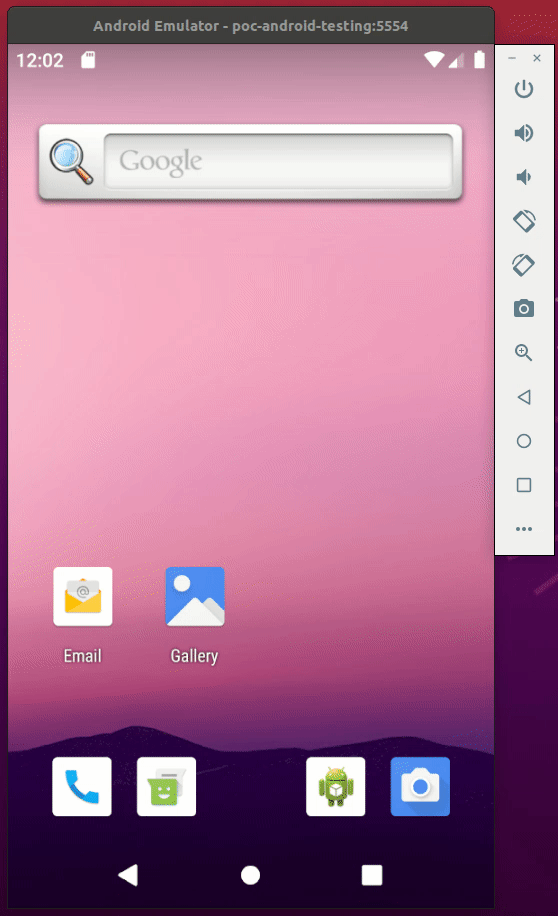

# POC: Android Testing

It demonstrates how to write unit tests and UI tests to an Android application.

The goal is to run unit tests using [JUnit](https://github.com/junit-team/junit4) in the host machine (JVM) and UI-based tests using [Espresso](https://developer.android.com/training/testing/espresso) running in an Android device.

The app has one activity with two views: a TextView and a Button. When the button is pressed a phone number is displayed.

There are unit tests that verify the specification of a Person that has a phone. These tests are run using the host machine JVM.

The UI tests verify that the user can interact with the app in a way that the expected behavior happens. These tests run in the Android JVM, so an emulator will open and start the application with a real device.

## How to run

| Description        | Command        |
| :----------------- | :------------- |
| Install tooling    | `make install` |
| Create the emulator | `make create`  |
| Delete the emulator | `make delete`  |
| Start the emulator | `make device`  |
| Run tests          | `make test`    |

## Preview

